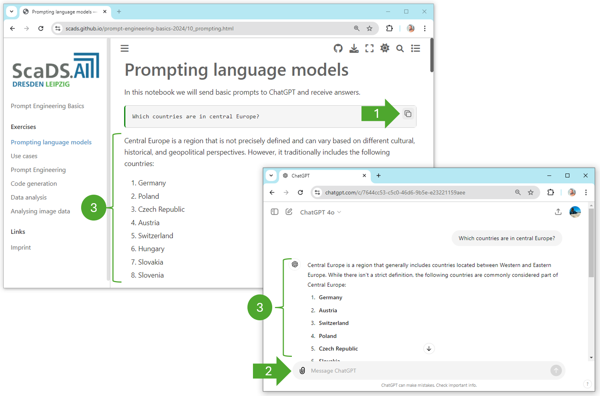

# Prompt Engineering Basics

This page is a collection of Jupyter Notebooks about Prompt Engineering. It aims at people without programming skills.

Contributions and feedback are very welcome! In case you see room for improvement, please [create a github issue](https://github.com/ScaDS/prompt-engineering-basics-2024/issues) and/or consider [contributing](https://github.com/ScaDS/Generative-AI-notebooks/blob/main/CONTRIBUTING.md).

## How to use this resource

For going through these materials, it is not necessary to install anything in your computer. You can follow along the exercises using online services such as 

* [OpenAI's ChatGPT](https://chat.openai.com/)
* [Anthropic's Claude](https://claude.ai/)
* [Google's Gemini](https://gemini.google.com/app)
* [Perplexity AI](https://you.com/)
* [You.com](https://you.com/)

... any many others. Depending on which service provider you use, you may need to sign up and probably pay for a subscription.

You can follow the exercises by copying (1) and pasting (2) the prompts from the notebooks in the LLM / ChatBot service of your preference. After submitting the prompt, you should receive similar responses (3) as shown.

In some of the exercises, we will generate data analysis Python code. For executing this code, it is recommended to install [mini-conda](https://docs.anaconda.com/miniconda/) and setup an environment for Python programming nd bio-image analysis as explained on [this page](https://haesleinhuepf.github.io/BioImageAnalysisNotebooks/01_introduction/readme.html). You can then also execute the shown code in Python Juptyer notebooks.

## Acknowledgements

We acknowledge the financial support by the Federal Ministry of Education and Research of Germany and by Sächsische Staatsministerium für Wissenschaft, Kultur und Tourismus in the programme Center of Excellence for AI-research „Center for Scalable Data Analytics and Artificial Intelligence Dresden/Leipzig“, project identification number: ScaDS.AI
